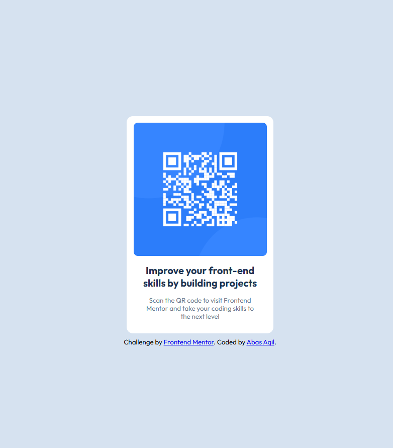

# Frontend Mentor - QR Code Component

## 📖 Overview

This is my solution to the **QR Code Component** challenge on Frontend Mentor. The goal of this project was to recreate the design as accurately as possible while practicing semantic HTML, responsive CSS, and clean code structure.

---

## 🚀 Technologies Used

- HTML5
- CSS3
- Flexbox
- Responsive Design

---

## 🎯 What I Learned

During this project, I practiced:

- Writing semantic HTML5
- Building responsive layouts
- Improving spacing and alignment
- Working with border-radius and colors
- Organizing CSS for better readability

---

## 🔗 Live Demo

https://abas-aqil.github.io/frontend-mentor-qr-code/

---

## 💻 GitHub Repository

https://github.com/abas-aqil/frontend-mentor-qr-code

---

## 🏆 Frontend Mentor Solution

(Add your Frontend Mentor solution link here after submitting.)

---

## 👤 Author

**Abas Aqil**

- GitHub: https://github.com/abas-aqil
- Portfolio: https://abas-aqil.github.io
- Frontend Mentor: https://www.frontendmentor.io/profile/YOUR_FRONTEND_MENTOR_USERNAME
